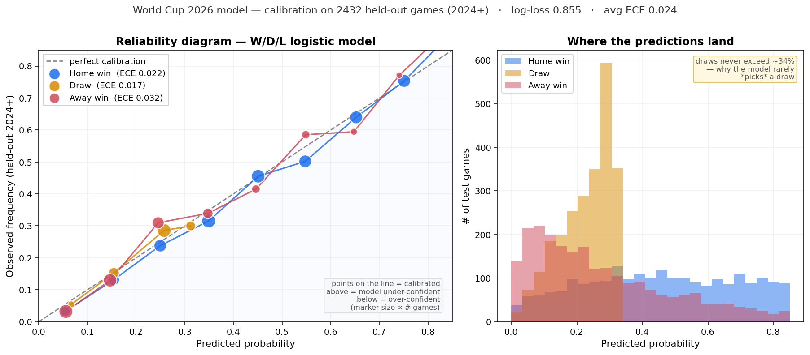

# World Cup 2026 — Match Outcome Predictor

A calibrated, leak-free model that forecasts every 2026 World Cup match — and the entire tournament — from international results since 1872, with a self-correcting cross-continental adjustment that learns from the data alone.

**Live dashboard:** [nic-world-cup-2026.streamlit.app](https://nic-world-cup-2026.streamlit.app)

---

## What it is

A pure-results predictor for the 48-team 2026 World Cup. No transfer values, no FIFA rankings, no betting odds in the loop — just every international result, fed through a self-computed **Glicko** rating (each team has a strength *and* an uncertainty) with an honest train / validate / test split.

The dashboard exposes six tabs:

- **Predict a match** — any two teams, neutral or home, W/D/L probabilities + expected goals + most-likely score
- **Group forecast** — all 72 group-stage fixtures with probabilities and likely scorelines
- **Ratings** — current Glicko rating (± uncertainty) for every national team, plus the per-confederation adjustment
- **Enter result** — record actual scores as they happen; the ratings absorb them and every prediction updates (password-gated on the deployed app)
- **Title odds** — 20,000-simulation Monte-Carlo of the whole tournament, spread by each team's *own* uncertainty
- **Bracket** — the single most-likely knockout path, R16 → final

---

## How it works

### 1. Self-computed Glicko ratings from raw results

One causal pass over every international match ever played. The rating each team carries *into* a match is what gets recorded — by construction, no result can leak into its own features.

**Why Glicko, not Elo.** Elo gives each team a single strength number and one *fixed* learning rate for everyone. International football, though, has wildly irregular schedules and hugely uneven data — Spain plays constantly, some minnow plays twice a year — and Elo treats them identically. **Glicko** carries a rating *and* a rating-deviation (RD = how sure we are), so the update **adapts to confidence**: uncertain / new / long-idle teams update fast and predict closer to 50/50; beating a team we know little about moves us less; RD grows during inactivity. On a fair head-to-head — both engines tuned the same way, same data, same features — **Glicko beat Elo on the held-out test** (overall log-loss 0.855 vs 0.860; cross-continental 0.879 vs 0.896), and it throws off real per-team uncertainty for the simulation as a bonus. Tunables (tuned by held-out log-loss): `home_advantage = 40` (zeroed at neutral venues), RD ceiling/floor, inactivity drift, importance weighting (World Cup 3×, qualifiers 2×, friendlies 1×), margin-of-victory multiplier.

### 2. Per-confederation offset (the cross-continental fix)

Only ~14% of international games cross confederations, and each top European team plays barely 10 of them in 8 years. That's not enough data to pin each confederation's strength against the others — ordinary Elo silently compresses the gap between UEFA / CONMEBOL and the weaker confederations.

The fix: maintain a per-confederation rating alongside the team ratings. Cross-continental games update *both* the team rating and a shared confederation offset. A team's effective rating = `team + offset[its confederation]`. Within-confederation games leave it alone (the offset cancels). The offset learns from pooled signal — the 758 CONMEBOL cross-confed games, not the 11 Spain plays. (Carried over unchanged from Elo — it's orthogonal to the rating engine.)

Tuned by held-out cross-confed log-loss; deliberately set below the raw loss-minimum to keep offsets football-plausible rather than overfit to tiny confederations.

### 3. Two complementary models on the same Glicko features

- **Glicko-logistic** — logistic regression on rating gap, home flag, absolute gap, and combined uncertainty. The W/D/L probabilities. (Momentum and rest were *forward-selected out* — they helped Elo, but Glicko's adaptive step already captures recent form, so on held-out data they no longer earned their place. Only the uncertainty feature survived.)
- **Glicko-Poisson + Dixon-Coles** — a Poisson goals model on the same features, with the Dixon-Coles low-score correction (rho fit by MLE). Produces both 1X2 probabilities and full scoreline distributions. (A negative-binomial variant was tested for goal overdispersion and dropped — once you condition on the rating-based expected goals, the residual overdispersion is negligible: held-out gain −0.0018.)

### 4. Full tournament Monte-Carlo

20,000 simulations of the 48-team format (12 groups, top 2 + 8 best thirds, R32 → R16 → QF → SF → final). Each simulation perturbs every team's rating by **its own Glicko uncertainty** (`N(0, 1.5 × team_RD)`) — so genuinely data-poor or volatile teams spread out more than well-known ones, instead of the flat ±125 fudge Elo needed. Group-stage tiebreakers, third-place slot assignment, and knockout penalty-shootout fallbacks all match the real tournament rules.

---

## Validation

Time-based splits, no peeking — train < 2022, validate 2022–23, test 2024–25.

| Metric | All games | Cross-continental |
|---|---|---|
| Log-loss (held-out test) | **0.855** | **0.879** |
| Accuracy | **60.4%** | **59.2%** |

**Glicko beat Elo on the same held-out test** — overall log-loss 0.855 vs 0.860, cross-continental 0.879 vs 0.896 — at identical accuracy, i.e. *sharper probabilities*. (The confederation offset, in turn, had cut cross-continental loss from ~0.926 down to ~0.896 over plain ratings.) The structural ceiling for results-only models on international football is around 0.86 log-loss and 60% accuracy — draws (~24% of games) are rarely the modal pick, so a hard floor of mispredicted games is unavoidable in any model.

### Calibration

When the model says 60%, do home teams actually win ~60% of the time? Yes — average **Expected Calibration Error is 0.024** on the held-out 2024+ games, comfortably inside the well-calibrated band (a touch higher than Elo's 0.019 — the small price for Glicko's sharper, lower-log-loss probabilities). Logistic regression minimises log-loss, a proper scoring rule, so calibrated probabilities fall out by construction — no Platt/isotonic step needed.



| Outcome | ECE (held-out test) |
|---|---|
| Home win | 0.022 |
| Draw | **0.017** |
| Away win | 0.032 |

The curves hug the diagonal (predicted = actual). Notably, **draws are the best-calibrated class** despite being the hardest to *pick* — calibration (are the probabilities honest?) and accuracy (is the top pick right?) are different things. The right panel shows why the model rarely picks "draw": draw probability never exceeds ~32%, so it's almost never the single most-likely outcome even when correctly assigned ~25%. Regenerate with `python scripts/calibration.py`.

### Against the sharp betting market

After de-vigging bookmaker outright odds (~21% overround removed) and comparing our title probabilities to the market across all 48 teams:

- **Correlation: 0.90** — we're not making qualitatively different predictions
- **Mean absolute divergence: 0.9 percentage points** — average distance from the market price, per team
- **Continental tilt (UEFA, sum of per-team diffs): −6.5 pts** — we under-rate Europe by this much in aggregate, *down from −12.5 pts before the confederation offset shipped*

The continental tilt against bookmakers roughly halved after the confederation offset. The residual UEFA gap is the **squad-depth premium** — the market knows Europe's bench is deeper than their starting XI suggests, which a results-only model structurally cannot see (we tried squad market value; it failed a leak-free test).

### What we believe vs the market

- **Higher than market on recent winners** — Spain (+6.2 pts), Argentina (+3.7), Croatia/Ecuador/Colombia
- **Lower than market on name-brands with weak form** — Brazil (−5.1), Portugal (−3.8), England (−3.8), France (−3.8)

That's the honest signature of a results-only model: it rewards what's been done, not who's traditionally good.

---

## Running locally

```bash
git clone https://github.com/Nic000111/world-cup-2026-predictor.git
cd world-cup-2026-predictor
python -m venv .venv && source .venv/bin/activate
pip install -r requirements.txt
streamlit run dashboard.py
```

Dashboard opens at `http://localhost:8501`. No password gate locally — the `ENTER_PWD` secret is only set in the deployed app.

### Reproducing the analysis

Each script in `scripts/` is standalone. Run from project root:

```bash
python scripts/market_comparison.py    # bookmaker comparison + continental tilt
python scripts/tune_confed.py          # the k_confed sweep that fixed the cross-confed gap
python scripts/tune_elo.py             # k_base and home_advantage tuning
python scripts/final_test.py           # held-out test set evaluation
python scripts/group_predictions.py    # generates the WC predictions CSV
```

---

## Project structure

```
.
├── dashboard.py            Streamlit app (the live URL)
├── wc.py                   WorldCupModel — Glicko + logistic + Poisson + Monte-Carlo
├── glicko_engine.py        SHIPPED rating engine — Glicko (rating + uncertainty) + confederation offset
├── elo.py                  legacy Elo engine (kept: shared weighting + the head-to-head baseline)
├── confed.py               Country → confederation lookup
├── results.csv             ~49k international results (1872 – present, martj42)
├── requirements.txt
├── scripts/                Analysis & tuning scripts (see scripts/README.md)
└── notebooks/              Early exploration notebook
```

---

## Methodology highlights

- **Time-based splits** — random k-folds would leak future information into past predictions. Validate 2022–23, hold out 2024–25, never peek.
- **Honest experiment register** — we tried cross-confed K-boost (failed), squad market value / player ratings / positional attack-defense (all failed leak-free tests — redundant with results), confederation offset (passed), and **swapping Elo → Glicko (passed — the biggest single win)**. Only what survived is shipped; the dead ends live on as documented scripts.
- **The smartest gain was a better model of the same data, not more data** — every external dataset (squad value, FIFA ratings, xG) was either redundant or inaccessible; the real win came from giving each team an *uncertainty* (Glicko) so the rating step adapts to how much we actually know.
- **No magic numbers** — every hyperparameter (`k_base`, `home_advantage`, `k_confed`) is tuned by held-out log-loss with the search documented in `scripts/`.
- **No copying the market** — when we discovered our model under-rates UEFA vs bookmakers by ~13 percentage points, the goal was *not* to match the market but to find the structural fix in our own data. The per-confederation offset closed about half of that gap from results alone.

---

## Data

[martj42 / international_results](https://github.com/martj42/international_results) — every international football result from 1872 to today (~49k matches), updated continuously by the maintainer. Re-pull anytime to refresh the ratings with the latest games.

## Acknowledgments

- Elo formulation inspired by [eloratings.net](https://www.eloratings.net/) (MoV multiplier shape)
- Dixon-Coles low-score correction: Dixon & Coles, *Modelling Association Football Scores and Inefficiencies in the Football Betting Market* (1997)
- Streamlit & scikit-learn for the application stack

---

## Limitations

A results-only model genuinely cannot see:
- Squad depth (Europe's 20th-best player vs CONMEBOL's)
- Injuries, lineup rotations between rating-update and match
- In-tournament fatigue, travel, weather
- Knockout-stage variance — single matches at the margin are coin-flips

These are baked into bookmaker prices but not into ours. That's not a bug to fix; it's a feature of being a transparent, interpretable, results-honest model. When we disagree with the market, the disagreements are interpretable — and that's the whole point.
